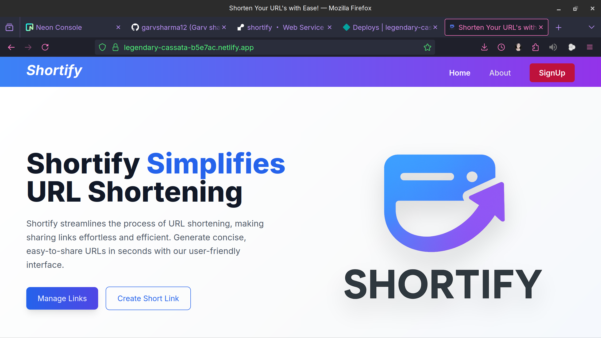
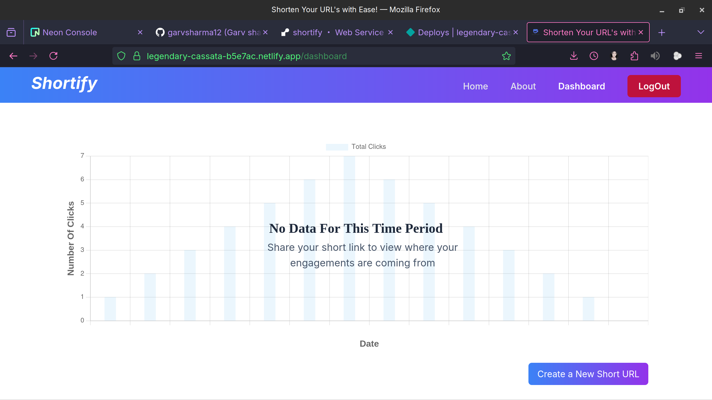
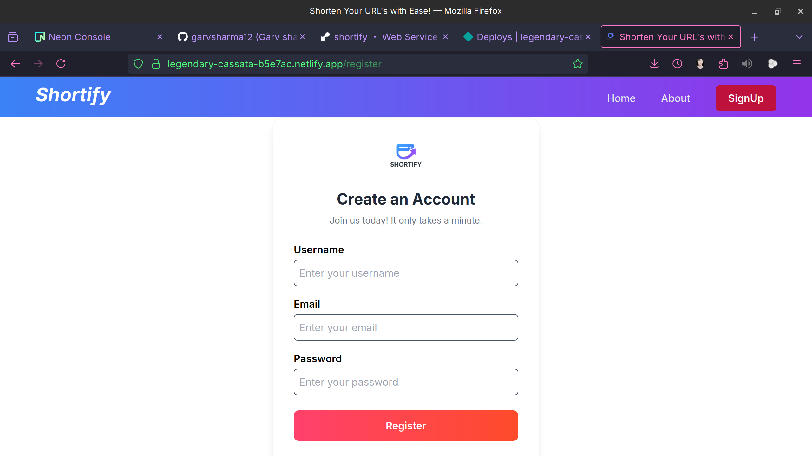
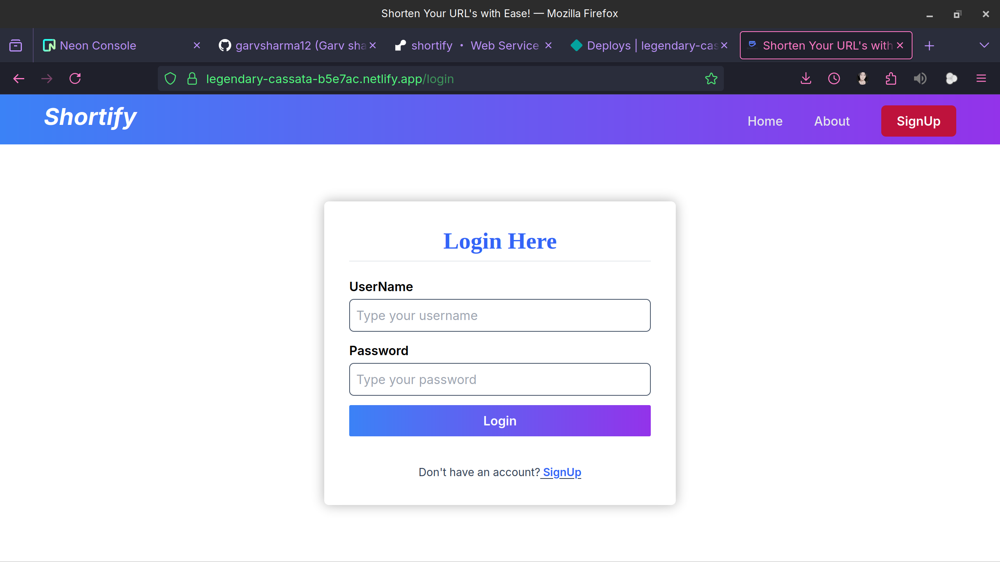
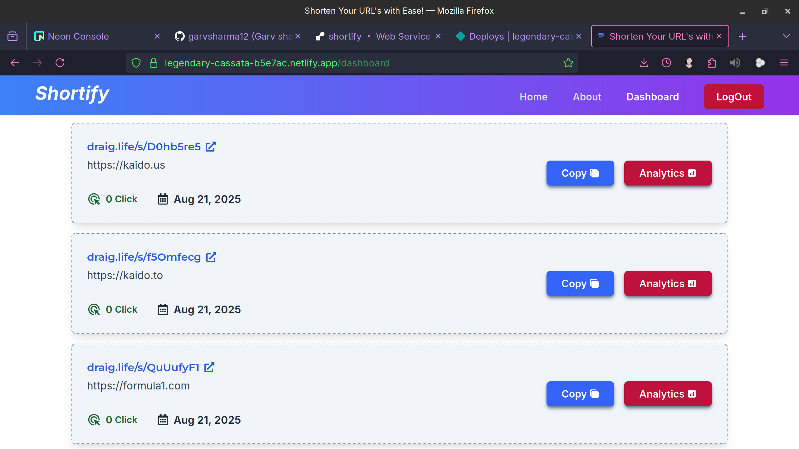

# 🔗 Shortify

Shortify is a **real-time URL shortening service** built with **Spring Boot (Java)** and a modern **ReactJS frontend**.  
It allows users to generate short, shareable links, track analytics, and manage their URLs securely.  

---

## 🚀 Features

✅ **URL Shortening**  
- Generate unique short links for any valid URL.  
- Instant redirection to the original long URL.  

✅ **User Authentication**  
- Secure registration & login.  
- **JWT-based stateless authentication**.  
- Role-based access control for enhanced security.  

✅ **Statistics & Analytics**  
- Track total clicks and usage frequency in **real-time**.  
- Interactive graphs & insights on link activity.  

✅ **Admin Controls**  
- Manage users and links efficiently.  

✅ **AWS Deployment (Production Ready)**  
- Backend deployed on **AWS EC2** (Spring Boot).  
- Database hosted on **AWS RDS** (MySQL/Postgres).  
- Frontend deployed on **AWS S3 + CloudFront** for global distribution.  
- Scalable architecture for handling high traffic.  

---

## 🛠️ Tech Stack

### **Backend**
- **Java 21**  
- **Spring Boot** (REST APIs)  
- **Spring Security** (Authentication & Authorization)  
- **JWT** (JSON Web Tokens)  
- **JPA + Hibernate**  
- **Maven**  
- **AWS RDS (MySQL/Postgres)**  

### **Frontend**
- **ReactJS** (component-based UI)  
- **TailwindCSS** (utility-first styling)  
- **Axios** (API communication)  

---

## 📸 Screenshots  

### 🏠 Home Page  
  

### 📊 Analytics & Graphs  
  

### 📝 Registration Page  
  

### 🔑 Login Page  
  

### ✂️ Working URL Shortening  
  

---

## ⚡ Real-Time Deployment

- The service is **deployed on AWS** with a production-ready setup.  
- Scalable backend with **Spring Boot APIs**.  
- **CDN (CloudFront)** ensures fast global access.  
- Secure environment with **JWT Authentication** and **role-based access**.  

---

## 🚀 Getting Started (Local Setup)

### Prerequisites
- Java 21  
- Maven  
- Node.js (for React frontend and Javascript)  
- MySQL/Postgres  

### Backend Setup
```bash
cd shortify_backend
mvn spring-boot:run
